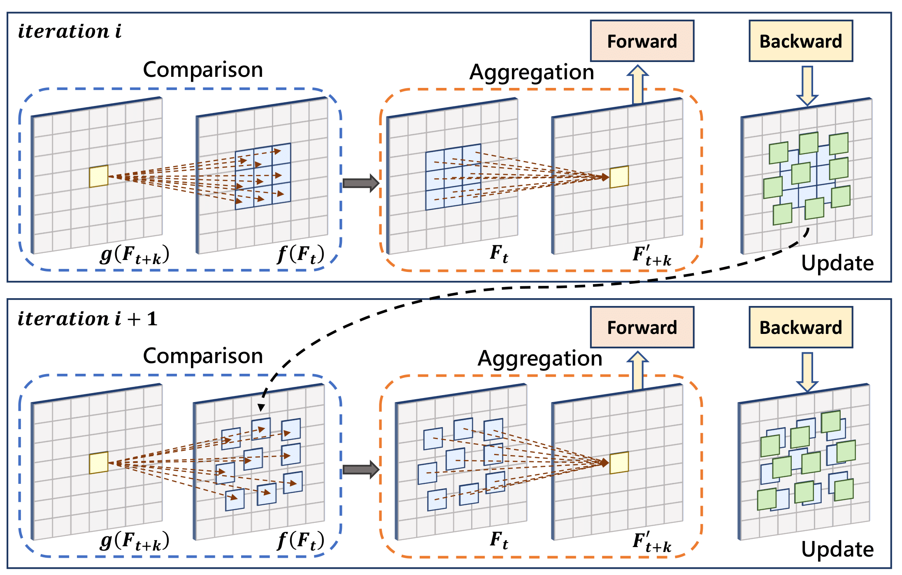

# Learning Where to Focus for Efficient Video Object Detection


[Paper](https://arxiv.org/pdf/1911.05253.pdf)
[Project Page](https://jiangzhengkai.github.io/LSTS/)

## News
- Full codebase is coming soon.


## Bibtex
```
@inproceedings{jiang2020learning,
  title={Learning Where to Focus for Efficient Video Object Detection},
  author={Jiang, Zhengkai and Liu, Yu and Yang, Ceyuan and Liu, Jihao and Gao, Peng and Zhang, Qian and Xiang, Shiming and Pan, Chunhong},
  booktitle={European Conference on Computer Vision},
  year={2020},
}
```
